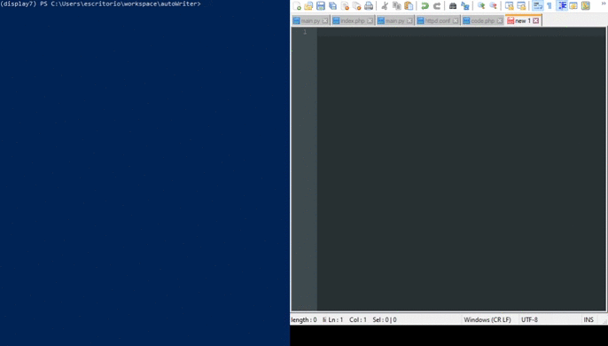

# autoWriter
*Transcribe texto automáticamente a partir de un archivo*

Se puede utilizar para grabar presentaciones de texto evitando errores de tipeo y lentitud, además puedes poner funciones especiales dentro de tu mismo texto!.

### Librerias necesarias para ejecutar la aplicacion
```bash
pip install prompt-toolkit pynput
```
## Comandos
- set config
  - file {} #Ingresa el archivo que quieres transcribir
  - timeBtChar {} #Tiempo entre cada escritura
  - timeFStart {} #Tiempo en segundos para la cuenta atrás del start
- start # Inicia la escritura
- reset # Vuelve al principio del archivo

## Funciones especiales
Sirven para que el autowriter ejecute acciones a partir de lo que lee en el archivo
### Escribir más lento
**[slow=0.4]**: autoWriter escribirá cada letra con una velocidad de 0.4

**[endslow=0]**: Vuelve a la velocidad configurada por defecto
### Hacer una pausa
**[sleep=10]**: AutoWriter hará una pausa de 10 segundos
### Detener la escritura
**[stop=0]**: AutoWriter dejara de escribir, sin embargo el puntero quedará en la última posición, utilizando el comando *start* podrás inicias nuevamente desde aquí

# Demostración
### Archivo a transcribir
[index.html.txt](./test/index.html.txt)
```html
<!doctype html>
<html lang="en">
<head>
	<meta charset="utf-8">
	<title>[slow=0.5]M[sleep=2]yApp[endslow=0]</title>
	<base href="/">
	<meta name="viewport" content="width=device-width, initial-scale=1">
	<link rel="icon" type="image/x-icon" href="favicon.ico">
</head>
<body>
	[stop=0]
	<app-root></app-root>
</body>
</html>
```


